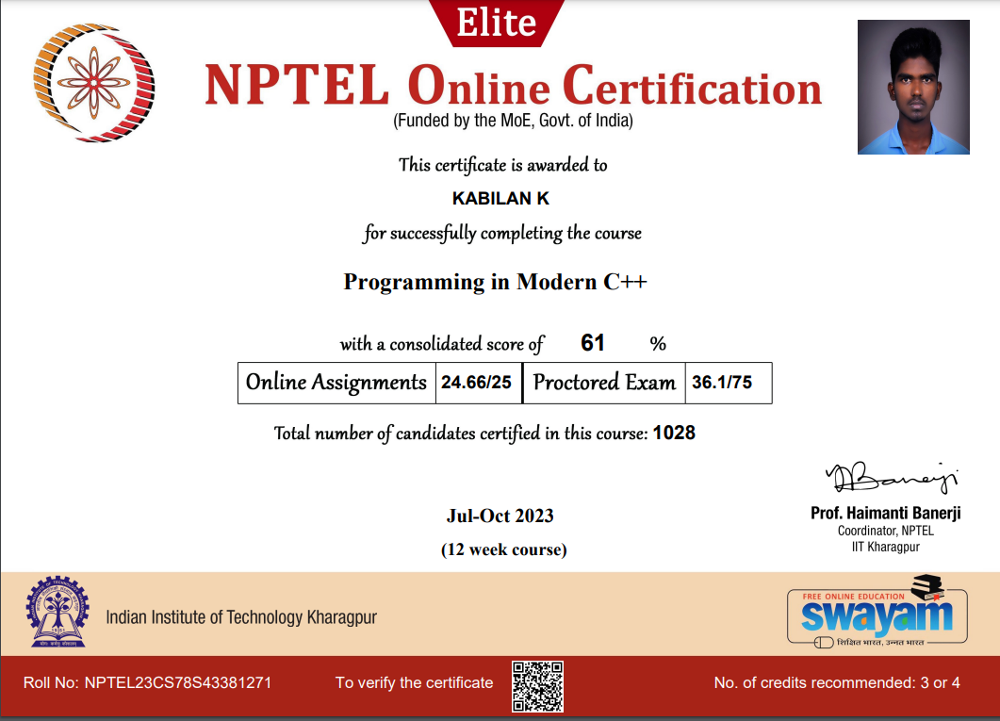

# NPTEL - Programming in Modern C++ Course

## Overview

This repository contains my solutions and notes for the NPTEL Java Programming course. The course covers fundamental Java concepts and aspects of Object-Oriented Programming.

### Course Details

- **Credit Points:** 3
- **Start Date:** 24 Jul 2023
- **End Date:** 13 Oct 2023
- **Exam Date:** 28 Oct 2023

## Topics Covered

Week 1: Programming in C++ is Fun.
Week 2: C++ as Better C.
Week 3: OOP in C++.
Week 4: OOP in C++.
Week 5: Inheritance.
Week 6: Polymorphism.
Week 7: Type Casting.
Week 8: Exceptions and Templates.
Week 9: Streams and STL.
Week 10: Modern C++.
Week 11: Lambda and Concurrency.
Week 12: Move, Rvalue and STL Containers.

## Certification

I have successfully completed the NPTEL - Programming in Modernn C++ course. Here is my certification:

## Getting Started

1. Clone this repository: `git clone https://github.com/kabilankavi131/Programming_in_Modern_CPP`
2. Navigate to the specific topic folder to access the code and notes.

## Prerequisites

- Basic knowledge of C++ programming language

## How to Use

- Each topic is organized in separate folders.
- Navigate to the desired topic to find relevant code and documentation.

## Contributing

Feel free to contribute by opening issues or submitting pull requests.
